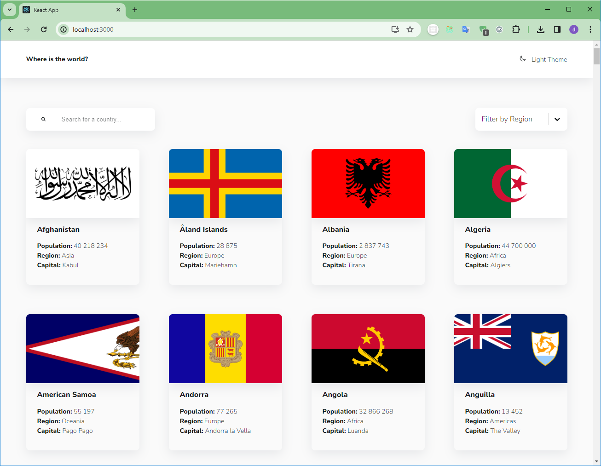
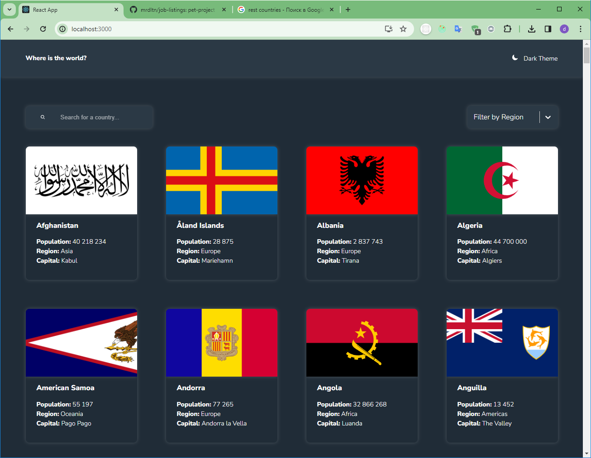
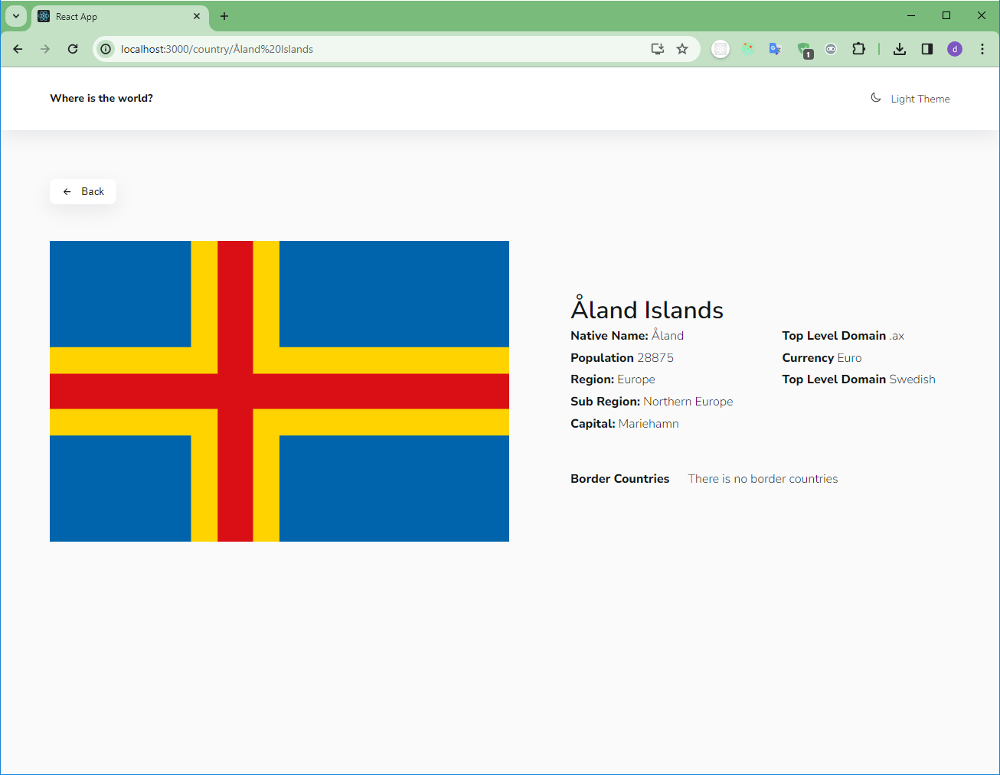
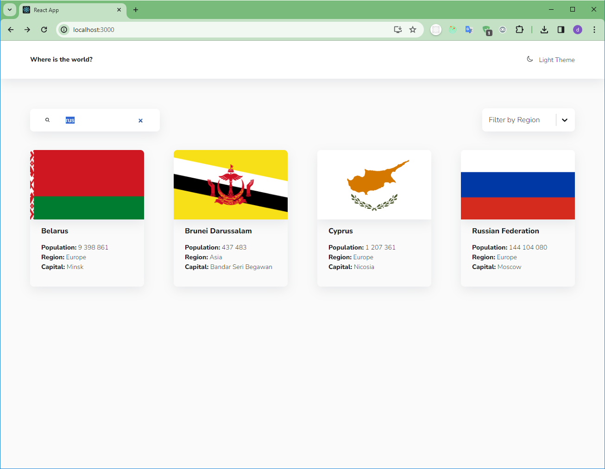
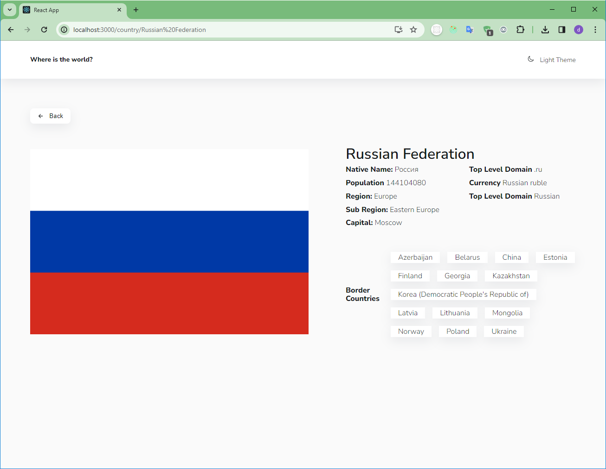
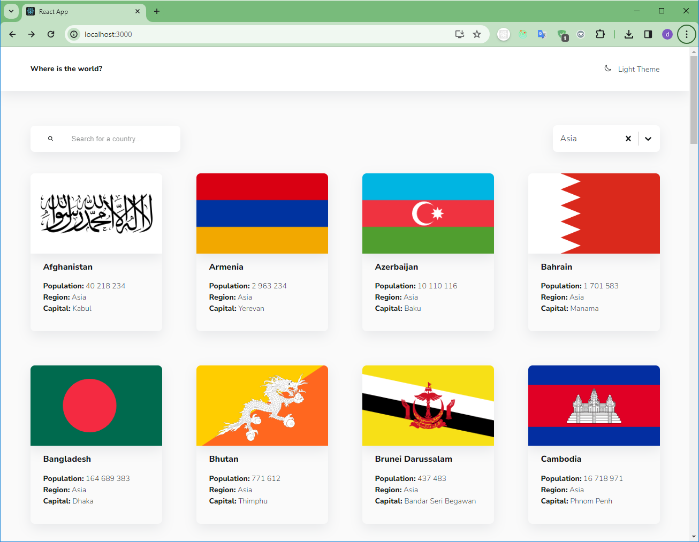

# https://mrdltn.github.io/rest-countries-api-with-theme-switcher

This is a simple 'The REST Countries API' with React on Redux

Main page

dark theme

Details page

Search by country

Details page with neighboring countries

Filtering by region
